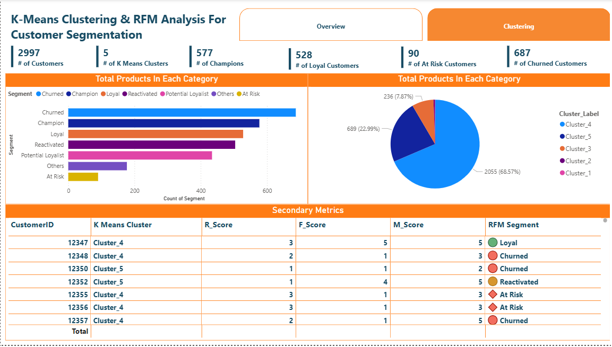
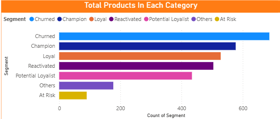
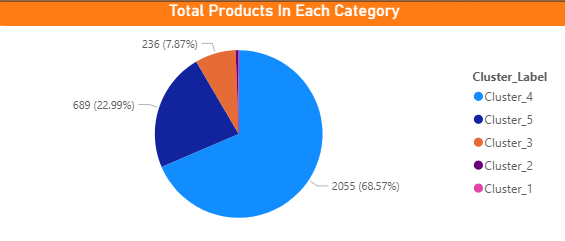

# 📊 K-Means Clustering & RFM Analysis Using Power BI

> Customer segmentation dashboard built in Power BI using RFM scoring and K-Means clustering on a real-world retail transaction dataset.


---

## 📌 Overview

This project applies **RFM (Recency, Frequency, Monetary)** analysis combined with **K-Means Clustering** to segment customers of a UK-based online retail store. The interactive Power BI dashboard provides actionable insights for targeted marketing and churn prevention.

| Metric | Value |
|---|---|
| Total Transactions | 536,641 |
| Unique Customers | 4,372 |
| Unique Products | 4,070 |
| Total Revenue | £9,726,007 |
| Date Range | Dec 2010 – Dec 2011 |
| Countries | 38 |

---

## 📸 Dashboard Preview

### 🖥️ Dashboard Overview


### 🔵 Cluster Scatter Plot


### 📊 RFM Distribution Charts



## 📁 Files

```
project/
├── df_sales_data.xlsx                               ← 536K transaction records (9 columns)
└── K-Means_Clustering___RFM_Analysis_Using_Power_BI.pbix  ← Power BI dashboard
```

---

## 🗃️ Dataset Schema — `df_sales_data.xlsx`

| Column | Type | Description |
|---|---|---|
| `InvoiceNo` | string | Unique transaction identifier |
| `StockCode` | string | Product / item code |
| `Description` | string | Product description |
| `Quantity` | int | Units purchased per transaction |
| `UnitPrice` | float | Price per unit in GBP (£) |
| `CustomerID` | int | Unique customer identifier |
| `Country` | string | Customer country (38 countries) |
| `Invoice Date` | date | Date of invoice |
| `TotalAmount` | float | Quantity × UnitPrice |

---

## 🔄 Analytics Pipeline

```
Raw Data (Excel)
    ↓
Data Cleaning (Power Query)
    ↓
RFM Score Calculation (DAX Measures)
    ↓
K-Means Clustering
    ↓
Interactive Power BI Dashboard
```

---

## 📐 RFM Dimensions

| Dimension | Description |
|---|---|
| **R — Recency** | Days since the customer's last purchase. Lower = more recent = higher score. |
| **F — Frequency** | Total number of unique invoices per customer. More purchases = higher engagement. |
| **M — Monetary** | Total spend aggregated by `CustomerID` across the analysis period. |

---

## 🎯 Customer Segments

| Segment | Description | Recommended Action |
|---|---|---|
| 🏆 **Champions** | Bought recently, buy often, spend the most | Reward them, ask for reviews |
| 💙 **Loyal Customers** | Regular buyers with solid spend | Loyalty programs, early access |
| ⚠️ **At Risk** | Used to buy frequently but haven't recently | Win-back campaigns |
| 💤 **Lost / Inactive** | Low recency, frequency, and spend | Reactivate with discounts or surveys |

---

## 🚀 Getting Started

1. Open `K-Means_Clustering___RFM_Analysis_Using_Power_BI.pbix` in **Power BI Desktop** (v2.0+ recommended).
2. If prompted, update the data source path to point to `df_sales_data.xlsx` on your local machine.
3. Click **Refresh** to re-run the Power Query steps and recalculate RFM scores.
4. Explore cluster visuals, filter by country or date range, and drill into individual segment metrics.

---

## 🛠️ Tools & Technologies

- **Power BI Desktop** — data modelling, DAX measures, interactive visuals
- **Power Query (M Language)** — data cleaning and transformation
- **K-Means Algorithm** — unsupervised clustering of RFM scores
- **Excel (.xlsx)** — source transaction data

---

